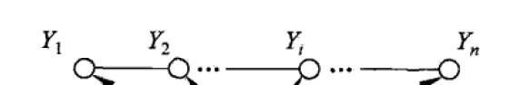
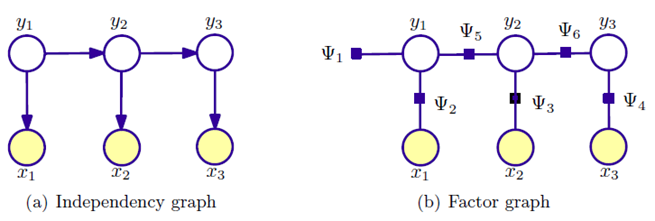

# 11章 条件随机场

### 条件随机场的定义与形式

- 定义：随机变量X条件下，随机变量Y是马尔科夫随机场

  主要介绍在定义在**线性链**上的特殊条件随机场。

  

  线性链的优势在于：相比于图，其最大团就是**相邻两个结点**
  $$
  P(Y_i | X,Y_1,…,Y_{i-1},Y_{i+1},…,Y_n) = P(Y_i | X,Y_{i-1},Y_{i+1})
  $$
  对比HMM：
  $$
  P(i_t|i_{i-1},o_{t-1},...,i_1,o_1)=P(i_t|i_{t-1})
  $$
  线性链的条件是双向的，前后都相关；HMM条件是单向的。

- 条件随机场的参数化形式
  $$
  P(y|x) = \frac{1}{Z(x)}\exp \left \{ \sum_{i,k}\lambda_k t_k (y_{i-1},y_i,x,i)+ \sum_{i,l}\mu_l s_l(y_i,x,i) \right \}
  $$

  $$
  Z(x) = \sum_y \left \{ \sum_{i,k}\lambda_k t_k (y_{i-1},y_i,x,i)+ \sum_{i,l}\mu_l s_l(y_i,x,i) \right \}
  $$

  - $t_k$ 是定义在**边上**的特征函数，称为转移特征（ t 是transition的缩写），依赖于当前和前一个位置

  - $s_l$是定义在**结点上**的特征函数，称为状态特征（s 是status的缩写），依赖于当前位置

    
  
  > **为什么这个形式？**
  >
  > 回忆无向图分解定理
  >
  > 
  
  
  
  整个CRF完全由特征$t_k,s_l$和权值$\lambda_k,\mu_l$决定
  
  
  
- 条件随机场的简化形式

  上述特征k在每一个位置i上都定义。为了简洁，可以把特征k在各个位置求和，作为全局特征k

- 条件随机场的矩阵形式

### 条件随机场的概率计算问题

计算$P(Y_i=y_i|x)$以及$P(Y_{i-1}=y_{i-1},Y_i=y_i|x)$和相应的数学期望

- 前向后向算法
- 概率计算
- 期望值计算

### 条件随机场的学习算法

- 改进的迭代尺度
- 拟牛顿法

### 条件随机场的预测算法

---

## 背景知识

吉布斯采样

***

## 问题

**能不能举一个例子来区分什么时候用HMM，什么时候用CRF？**

- HMM处理的是有向图模型，条件依次向后传播
- CRF是无向图，不能只有条件分布，而应该用衡量联合分布，($P(Y_2|Y_1)\neq P(Y_1|Y_2)$)

HMM考虑的更简单，CRF更全面

**CRF为什么能够解决MEMM的问题？**

---

## 附录

**线性链条件式的推导**

用全局马尔科夫性，$Y_{i-1}$给定，$Y_i$与前面无关；$Y_{i+1}$给定，$Y_i$与后面无关
$$
P(Y_i,Y_{1,i-2} | X,Y_{i-1})=P(Y_i|Y_{i-1})P(Y_{1,i-2}|Y_{i-1}) \quad \text{全局马尔科夫性}\\
$$

$$
P(A|B)=P(A)\quad \text{if A与B独立}
$$

