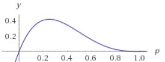
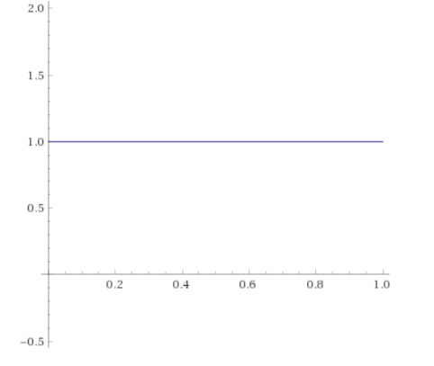
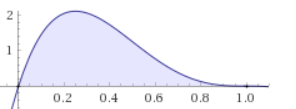
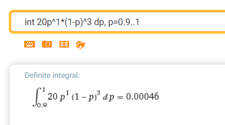
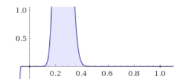

# 菜鸡or高手？

#### 问题：

小张觉得自己是个守望先锋的高手，逢人就吹嘘自己实力高超。可是昨天他打了四把守望先锋，3负1胜。

你嘲讽他胜率只有25%，算不得强；但是他马上反驳说，你概率论学的太差了，就算90%胜率也会打出3负1胜的战绩。

你一时陷入了沉思：

1、假如小张真的是90%胜率的个中高手，请问他打出3负1胜的概率有多少？

2、如果小张是个胜率只有25%的菜鸡，请问他打出3负1胜的概率有多少？

3、请根据前两问，推广小张胜率为p时，打出3负1胜的概率的表达式，并绘出图像？

>  安利wolframalpha！绘制函数图像、计算积分、导数等
>
> https://www.wolframalpha.com/input/

4、如果我们先验地认为任何人胜率的分布是均匀的，然后”3负1胜“是一次对小张的观测，那么根据这次观测，请给出小张胜率的分布

5、如果你是电竞俱乐部的数据分析师，你的经理想录用小张加入职业战队，并询问你的意见。俱乐部录用的选手，都必须**以90%的置信度，胜率达到90%以上**。试计算小张胜率90%以上的置信概率？结合结果，你觉得小张能被录用吗？

6、但你的经理觉得小张骨骼惊奇，是个苗子，想搏一搏：**以1%置信度，胜率达到70%以上**，并重新询问你的意见。请问你觉得现在小张还能被录取吗？

7、小张最终想办法混进了你的战队，在战队他又打了96局，总计100局结果25胜75负。请问这时小张的胜率分布改变了吗？经理现在有一些怀疑小张的水平了，但是他没有证据。你作为数据分析师，请计算小张现在还能做到**以10%置信度，胜率达到50%以上**吗？

8、请结合上面的练习，谈谈你的先验分布和后验分布的新理解（主观题）

#### 解答：

记胜率=p

1、

$C_{4}^{1}p^1(1-p)^3=0.0036$

2、

$C_{4}^{1}p^1(1-p)^3=0.421875$

3、

$C_{4}^{1}p^1(1-p)^3$

绘图

4、

记A=“3负1胜”，记B=“小张胜率=p”
$$
\begin{align}P(B|A)&=\frac{P(A|B)P(B)}{P(A)}\\
\end{align}
$$
P(A)是考虑所有胜率下“3负1胜”出现的概率，做积分
$$
P(A)=\int_{0}^1 C_{4}^1 p(1-p)^3dp
$$

“胜率分布均匀”，反应在概率密度如下，任何胜率出现的概率一样

综合两个结论，得到
$$
\begin{align}
P(B|A)&=\frac{P(A|B)P(B)}{P(A)}\\
&=\frac{C_{4}^1 p(1-p)^3*1}{\int_{0}^1 C_{4}^1 p(1-p)^3dp}\\
&=\frac{C_{4}^1 p(1-p)^3}{0.2}\\
&=20p(1-p)^3
\end{align}
$$
形式似乎变化不大，但是注意到$\int_0^120p(1-p)^3dp=1$，而之前$P(A)=\int_{0}^1 C_{4}^1 p(1-p)^3dp$充当了归一化因子。  

我们记小张的胜率概率密度为$f(p)$  

5、
$$
\begin{align}
\text{胜率在90%以上发生的概率}&=\int_{0.9}^1f(p)dp\\
&=\int_{0.9}^{1}20p(1-p)^3dp \\
&=0.00046
\end{align}
$$
所以小张远远达不到要求

6、
$$
\begin{align}
\text{胜率在70%以上发生的概率}&=\int_{0.7}^1f(p)dp\\
&=\int_{0.7}^{1}20p(1-p)^3dp \\
&=0.03078
\end{align}
$$
所以小张这次还真的能被录用了，气不气~   ヾ(ｏ･ω･)ﾉ 

7、

结论：小张的胜率分布改变了。

记A=“3负1胜”，记B=“小张胜率=p”
$$
\begin{align}
P(B|A)&=\frac{P(A|B)P(B)}{P(A)}\\
&=\frac{C_{100}^{25}p^{25}(1-p)^{75}*1}{\int_{0}^1 C_{100}^{25}p^{25}(1-p)^{75}dp}\\
&=\frac{C_{100}^{25}p^{25}(1-p)^{75}}{0.01}\\
&=2.425*10^{25}*p^{25}(1-p)^{75}\\
\end{align}
$$
小张胜率的分布已经非常集中了于0.25了附近了  

现在我们再来计算小张的胜率>70%的概率  
$$
\begin{align}
\text{胜率在70%以上发生的概率}&=\int_{0.7}^1f(p)dp\\
&=2.425*10^{25}\int_{0.7}^{1}p^{25}(1-p)^{75}dp \\
&=9.05848×10^{-21}
\end{align}
$$
是时候请经理让小张卷铺盖走人了！  

事实上，现在小张胜率<40%的概率已经高至99.91%，菜鸡实锤

#### 总结

所以，只要掌握了概率论的武器，多和菜鸡们打几把，就能让菜鸡无所遁形  

