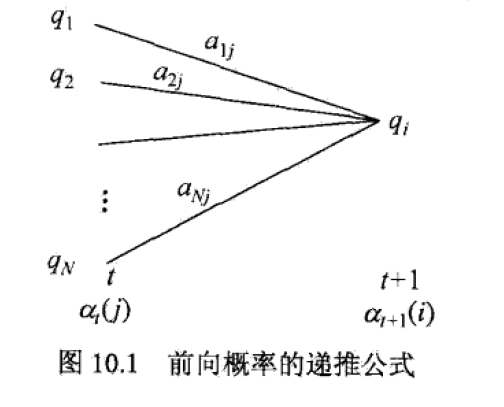
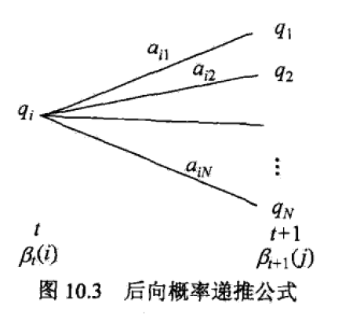
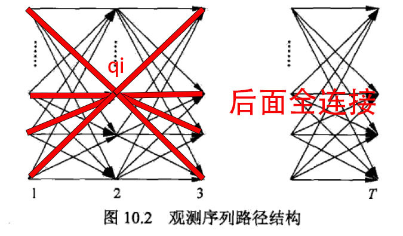
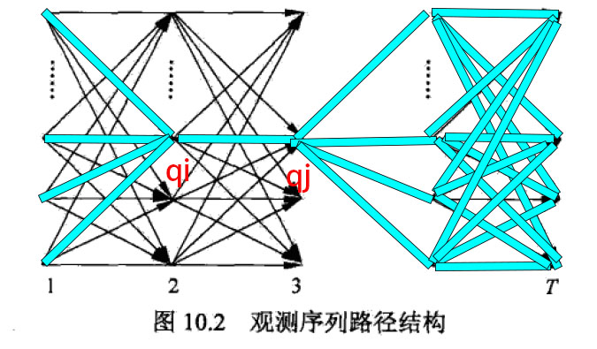
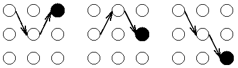
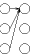

# 第10章 隐马尔可夫模型

- #### 隐马尔可夫模型的基本概念

  三要素：
  $$
  \lambda = (A,B,\pi)
  $$

  - 初始状态概率向量，π
  - 状态转移矩阵A，$a_{ij}$表示从状态i到状态j的概率
  - 观测矩阵B，$b_{jk}$表示在状态j产生观测k的概率

  

  齐次性假设：马尔科夫链转移时只依赖前一时刻的状态

  

  独立性假设：观测只依赖于该时刻的马尔科夫状态

  

  隐马尔可夫的三个基本问题：

  （1）概率计算：给定模型和观测序列，计算出现概率——似然

  （2）学习问题：已知观测序列，估计模型参数——最大似然估计

  （3）预测问题：已知模型和观测序列，求状态序列——估计隐变量

- #### 概率计算算法

  直观算法：

  观测既然是状态产生的，那有$P(观测)=\sum_{所有可能状态序列} P(观测|状态)P(状态)$，并且$P(I|\lambda)$和$P(O|I,\lambda)$都是从t=0一直算到t=T

  但计算量太大了$O(TN^T)$

  

  - 前向算法：

    定义一个中间结果：$\alpha_t(i)=P(o_1,o_2,...,o_t,i_t=q_i|\lambda)$

    直观算法的坏处是没有存储中间结果。使用动态规划题常见的策略，截断在第i个状态，可以写递推式找到t+1和t之间的关系
    $$
    a_{t+1}(i)=\left[\sum_{j=1}^N\alpha_t(j)\alpha_{ji}\right]b_i(o_{t+1})
    $$
    

    

    这个式子的直观理解：

    

     t+1状态为$q_i$，可以拆解为若干个前一状态$q_j$的转移，并求和
    $$
    P(i_{t+1}=q_i)=\sum_{j=1}^NP(i_t=q_j)a{ji}
    $$
    同时要求t+1观测序列也正好是$o_1,o_2,...o_t,o_{t+1}$，但巧了t时刻已经满足了o_1,o_2,...o_t，并且转移到了$q_i$。

    那么只需要在观测到$o_{t+1}$即可，也即最外面*$b_i(o_{t+1})$

    最后有
    $$
    P(O|\lambda)=\sum_{i=1}^N\alpha_T(i)
    $$
  
- 后向算法：
  
  类似思想
  
  定义一个条件概率中间结果：$\beta_t(i)=P(o_{t+1},o_{t+2},...,o_T|i_t=q_i,\lambda)$
  
  
  
  
  
  总结一下，怎么想到前向后向的呢？
  
  答案是直接拆分目标$P(O|\lambda)$
  $$
    P(O|\lambda)=
    \begin{cases}
    \sum_{i=1}^N P(o_1,o_2,...o_T,i_T=q_i|\lambda)\quad \text{在末尾求和，对状态求和，将其消去}\\
    \sum_{i=1}^N P(o_2,o_3...o_T|i_1=q_i,\lambda)\pi_ib_i(o_1)\quad \text{在开头求和，条件概率乘法消去状态}\\
    \end{cases}
  $$
  
- 利用前后向算法：
  
  - t时刻出于状态$q_i$的概率
  
    
    $$
      \begin{align}
      \gamma_t(i)&=P(i_t=q_i|O,\lambda)\\
      &=\frac{P(i_t=q_i,O|\lambda)}{P(O|\lambda)}\quad \text{}\\
      &=\frac{P(i_t=q_i,o_1,o_2...o_t,o_{t+1}...o_T|\lambda)}{P(O|\lambda)}\quad \text{将O展开}\\
      &=\frac{P(i_t=q_i,o_1,o_2...o_t|\lambda)P(o_{t+1}...o_T|i_t=q_i,o_1,o_2...o_t,\lambda)}{P(O|\lambda)}\quad \text{有P(A,B,C)=P(A,B)P(C|A,B)}\\
      &=\frac{P(i_t=q_i,o_1,o_2...o_t|\lambda)P(o_{t+1}...o_T|i_t=q_i,\lambda)}{P(O|\lambda)}\quad \text{马尔科夫性，在it给定后，前后状态独立}\\
      &=\frac{\alpha_t(i)\beta_t(i)}{P(O|\lambda)}\\
      &=\frac{\alpha_t(i)\beta_t(i)}{\sum_{j=1}^N \alpha_t(i)\beta_t(i)}\quad \text{求和消去了状态it}\\
      \end{align}
    $$
    
  - t处在状态$q_i$且t+1处在$q_{t+1}$的概率
  
    
    $$
      \begin{align}
      \xi_t(i,j)&=P(i_t=q_i,i_{t+1}=q_j|O,\lambda)\\
      &=\frac{P(i_t=q_i,i_{t+1}=q_j,O|\lambda)}{P(O|\lambda)}\quad \text{}\\
      &=\frac{P(i_t=q_i,i_{t+1}=q_j,O|\lambda)}{\sum_{i=1}^N\sum_{j=1}^NP(i_t=q_i,i_{t+1}=q_j,O|\lambda)}\quad \text{}\\
      &=\frac{\alpha_t(i)a_{ij}b_j(o_{t+1})\beta_{t+1}(j)}{\sum_{i=1}^N\sum_{j=1}^NP(i_t=q_i,i_{t+1}=q_j,O|\lambda)}\quad \text{1~t还是α，aij表明i->j，并且qj表达成oj，后面是β}\\
      &=\frac{\alpha_t(i)a_{ij}b_j(o_{t+1})\beta_{t+1}(j)}{\sum_{i=1}^N\sum_{j=1}^N\alpha_t(i)a_{ij}b_j(o_{t+1})\beta_{t+1}(j)}\quad \text{}\\
      \end{align}
    $$
    
    - 计算期望
  
      （1）状态qi出现的期望$\sum_{t=1}^T\gamma_t(i)$
  
      （2）状态qi转移出去的期望$\sum_{t=1}^{T-1}\gamma_t(i)$
  
      （3）由状态qi转移到qj的期望$\sum_{t=1}^{T-1}\xi_t(i,j)$

- 学习算法

  - 监督学习

    统计频次就行了直接最大似然估计，很直觉

    但是EM算法中M步往往跟这里的直觉很相符。

  - 无监督学习Baum-Welch算法

    把状态I看成隐变量
    $$
    P(O|\lambda)=\sum_IP(O|I,\lambda)P(I|\lambda)
    $$
    E：定义Q函数
    $$
    \begin{align}
    Q(\lambda,\overline{\lambda})&=\sum_Z\log P(Y,Z|\theta)P(Z|Y,\theta^{(i)})\quad \text{Q函数定义}\\
    &=\sum_I\log P(O,I|\lambda)P(I|O,\overline{\lambda})\quad \text{}\\
    &=\sum_I\log P(O,I|\lambda)\frac{P(O,I|\overline{\lambda})}{P(O|\overline{\lambda})}\quad \text{分母相对于λ是常数，我们的目标是极大化Q}\\
    &=\sum_I\log P(O,I|\lambda))P(O,I|\overline{\lambda})\quad \text{}\\
    \end{align}
    $$
    M：求导极大

    更新公式的直观解释：

    - $$
      a_ij=\frac{\sum_{t=1}^{T-1}\xi_t(i,j)}{\sum_{t=1}^{T-1}\gamma_t(i)} \quad \text{从i到j的期望/从i转移出去的期望}
      $$

    - $$
      b_j(k)=\frac{\sum_{t=1,o_t=v_k}^{T}\gamma_t(j)}{\sum_{t=1}^{T}\gamma_t(i)} \quad \text{转移到j并且表达为k的期望/转移到j的概率}
      $$

    - $$
      \pi_i=\gamma_1(i) \quad \text{t=1出现状态i的期望}
      $$

      

- 预测算法

  - 近似算法（贪心）

    每次选择最有可能出现的状态$i_t^*$，组成一个序列

    但是这个序列可能不是整体上最有可能的

  - 维特比算法
  
    全局最优的状态序列，部分路径也必须最优：如果A-D中间，有一段B-C不是最优的，那么可以将其替换成B'-C'，得到新的A-D会比原来的更好
  
    每一个状态j都有一条路径，比如下图，三个状态有不同的路径到达。但是有一点是确定的，这三种路径都在最后一个状态被定死的情况下，让输出序列的概率最大——$P(o_1,o_2,o_3|i_3=q_j)$。
  
    
  
    然后我们根据t=3得到的概率继续往下走，会发现t=3时刻的每一个状态都可以转移到t=4的3个状态。那么就会产生如下的情况
  
    
  
    那么这时候，我们选择哪一个呢？
  
    这就是维特比算法的重点，对于达到同一状态的路径，选择最优的，舍弃其他。因为后续5,6...T的状态跟1,2,3的路径无关了！
  
    这样，t=4的状态1就有唯一的路径了。同理，其他状态也有了唯一路径。
  
    定义“在t时刻到状态i的”最大路径：
    $$
    \delta_t(i)=\mathop{max}_{i)1,i_2,...,i_{t-1}}P(i_t=i,i_{t-1},...i_1,o_t,...,o_1|\lambda),i=1,2,...N
    $$
    递推公式：
  
    其实就是多一步转移$a_{ji}$
    $$
    \begin{align}
    \delta_{t+1}(i)&=\mathop{max}_{i)1,i_2,...,i_{t-1}}P(i_{t+1}=i,i_t,...i_1,o_{t+1},o_t,...,o_1|\lambda),i=1,2,...N\\
    &=\mathop{max}_{1\leq j\leq N}[\delta_t(j)a_{ji}]b_j(o_{t+1})
    \end{align}
    $$
    
  
    
  
    上一个结点变量：
  
    求解能使得转移概率最大的上一个结点
    $$
    \Psi_t(i)=\mathop{argmax}_{1\leq j\leq N}[\delta_{t-1}(j)a_{ji}]
    $$
    
  
    