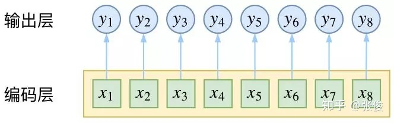
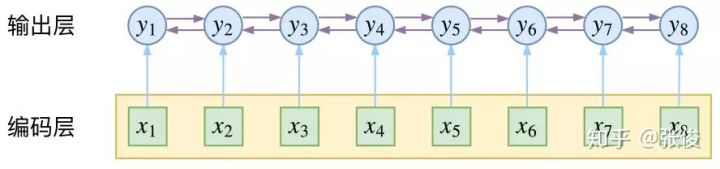
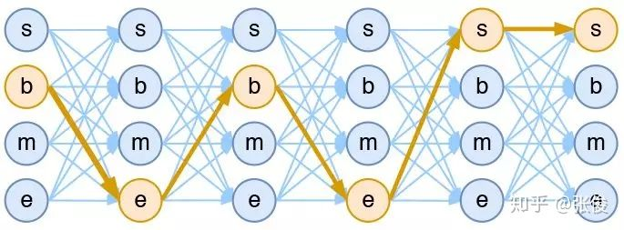
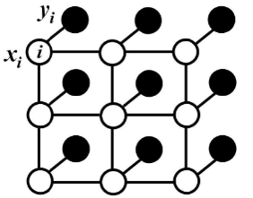
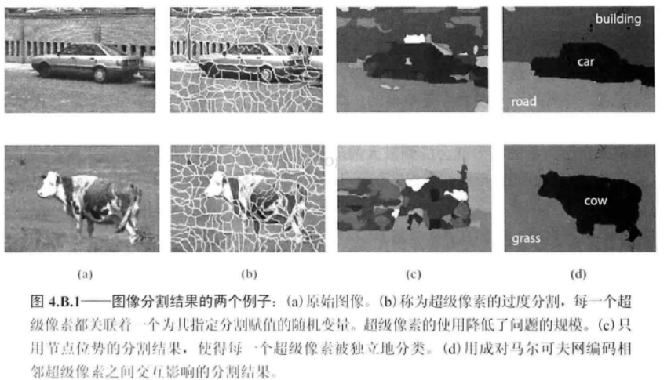

# 11章 条件随机场

### 上下文关联的标注问题

https://zhuanlan.zhihu.com/p/37163081

- 逐层独立预测

  

- CRF

  

**逐层预测将序列标注看成是 n 个 k 分类问题，CRF将序列标注看成是 1 个** $k^n$ **分类问题**。

### 条件随机场的定义与形式

- 定义：随机变量X条件下，随机变量Y是马尔科夫随机场

  主要介绍在定义在**线性链**上的特殊条件随机场。

  

  线性链的优势在于：相比于图，其最大团就是**相邻两个结点**
  $$
  P(Y_i | X,Y_1,…,Y_{i-1},Y_{i+1},…,Y_n) = P(Y_i | X,Y_{i-1},Y_{i+1})
  $$
  对比HMM：
  $$
  P(i_t|i_{i-1},o_{t-1},...,i_1,o_1)=P(i_t|i_{t-1})
  $$
  线性链的条件是双向的，前后都相关；HMM条件是单向的。

- 条件随机场的参数化形式
  $$
  P(y|x) = \frac{1}{Z(x)}\exp \left \{ \sum_{i,k}\lambda_k t_k (y_{i-1},y_i,x,i)+ \sum_{i,l}\mu_l s_l(y_i,x,i) \right \}
  $$

  $$
  Z(x) = \sum_y \left \{ \sum_{i,k}\lambda_k t_k (y_{i-1},y_i,x,i)+ \sum_{i,l}\mu_l s_l(y_i,x,i) \right \}
  $$

  - $t_k$ 是定义在**边上**的特征函数，称为转移特征（ t 是transition的缩写），依赖于当前和前一个位置
- $s_l$是定义在**结点上**的特征函数，称为状态特征（s 是status的缩写），依赖于当前位置
  

  
  求和号里面，其实是一条路径的置信度（下图是词性标注，每一列是一个词可能的词性）
  
  把所有的置信度加起来作为规范化因子，然后除一下，就是概率了
  
  
  
  
  
  >**特征函数是什么意义？**
  >
  >本身我们量化联合分布喜欢这样：
  >$$
  >\begin{aligned}P(y_1,y_2,\dots,y_n)=&P(y_1) P(y_2|y_1) P(y_3|y_1,y_2)\dots P(y_n|y_1,\dots,y_{n-1})\\ 
  >=&P(y_1) P(y_2|y_1) P(y_3|y_2)\dots P(y_n|y_{n-1}) \quad \text{马尔科夫性}\\
  >\end{aligned}
  >$$
  >但是谁说$y_1$，$y_2$之间有这样的条件关系呢？这可是一个很强的建模假设
  >
  ><u>我们不应该加入太多假设，所以就假定他们之间只是有某种共现关系，间接衡量了他们的联合分布。这个函数就是特征函数f(x,y)​了</u>
  >
  >所以应该写作
  >$$
  >P(y|x) = \frac{1}{Z(x)}\exp\left(\sum_k \omega_k f_k(y,x)\right)
  >$$
  >上式式中单独的一项$\frac{\exp(\omega_k f_k(y,x))}{Z(x)}$是没有概率意义的，但之前的$P(y_2|y_1)$则有
  >
  >所以CRF是更一般的形式
  >
  >
  >
  >这种特征函数，可以是物理上的能量函数，也可以是置信度，也可以是共现次数。总之这个值的大小，反映了变量同时出现的可能性。（统计物理例子见附录）
  >
  >深度学习中的的softmax公式中，CNN相当于特征函数得到的是置信度，越可能出现，置信度就越大，然后通过softmax把置信概率转换成概率
  >$$
  >P(Y=y_i)=\frac{e^{CNN(x)}}{\sum_{c=1}^C e^{CNN(x)}}
  >$$
  
  
  
  > **为什么是这样的求和形式？**
  >
  > 回忆无向图分解定理
  > $$
  > \begin{align}
  > P(Y) &= \frac{1}{Z} \prod_C \Psi_C(Y_C)\\
  > \Psi_C(Y_C) &= \exp \left \{-E(Y_C) \right \} \quad &\text{E是边集上的函数}\\
  > \prod_C \Psi_C(Y_C)&=\exp\left \{ \sum-E(Y_C) \right \} \quad &\text{连乘Exp=Exp连加}
  > \end{align}
  > $$
  > 这其中$t_k$建立在边上，代表了边两点之间的关系；$s_l$建立在点上，代表了点自身的特性
  
  
  
  整个CRF完全由特征$t_k,s_l$和权值$\lambda_k,\mu_l$决定
  
  
  
- 条件随机场的简化形式

  上述特征k在每一个位置i上都定义。为了简洁，可以把特征k在各个位置求和，作为全局特征k

  用f来合并t和s，用ω合并λ和μ

- 条件随机场的矩阵形式

  

  

### 条件随机场的概率计算问题

计算$P(Y_i=y_i|x)$以及$P(Y_{i-1}=y_{i-1},Y_i=y_i|x)$和相应的数学期望

- 前向后向算法
- 概率计算
- 期望值计算

### 条件随机场的学习算法

- 改进的迭代尺度
- 拟牛顿法

### 条件随机场的预测算法

---

## 背景知识

吉布斯采样

***

## 问题

**HMM与CRF的区别？**

- HMM处理的是有向图模型，条件依次向后传播
- CRF是无向图，不能只有条件分布，而应该用衡量联合分布，($P(Y_2|Y_1)\neq P(Y_1|Y_2)$)

HMM考虑的更简单，CRF更全面

**CRF应用的例子？**

图像分割。一般用于CNN model最后输出每个像素分类置信概率之后。

这里$x_i$是标签，$y_i$是输入像素。标签是相互依存的，并不能根据超像素独立地预测标签。

- $s_l$是这里变成CNN输出的置信概率，一元势函数。

  在本应用中，就是CNN给出的置信概率，代表一个像素点本身被分类的信心

- $t_k$是这里变成pixel_distance，二元势函数。

  在本应用中，是像素之间像素强度的相似度，越相似的像素点，越应该被分类到同一个类。

  pixel_distance有如下功能，如果输入的像素非常接近，同时label还不一样，那么就返回一个非常小的值；否则返回较大值

$$
P(y|pixels) = \frac{1}{Z(x)}\exp \left \{ \sum_{i,k}\lambda_k \; \text{pixel_distance} (y_{i-1},y_i,pixels,i)+ \sum_{i,l}\mu_l \;\text{CNN_model}(y_i,pixels,i) \right \}
$$

---

## 附录

**线性链条件式的推导**

用全局马尔科夫性，$Y_{i-1}$给定，$Y_i$与前面无关；$Y_{i+1}$给定，$Y_i$与后面无关
$$
P(Y_i,Y_{1,i-2} | X,Y_{i-1})=P(Y_i|Y_{i-1})P(Y_{1,i-2}|Y_{i-1}) \quad \text{全局马尔科夫性}\\
$$

$$
P(A|B)=P(A)\quad \text{if A与B独立}
$$

**配分函数在统计物理中的应用**

统计物理中，一个气体系统的各项宏观属性其实是微观属性的统计平均值。

一个气体系统的中有各种不同能量的粒子，处于不同能级的粒子有不同的速度；与此同时，不同能级的粒子的数目服从一定的分布。

<u>如何依据粒子的能级分布，以及能力对应的各种微观量，求出宏观量的统计均值，是一个统计问题</u>

事实上，根据物理规律，我们能拿到不同能级的粒子数目的比值。在玻尔兹曼统计中，如果将处于基态的粒子数设为1，那么处于激发态i的粒子数目是$e^{-\epsilon i/kT}$

那么第i能级的占比是多少呢？
$$
Z=\frac{e^{-\epsilon i/kT}}{\sum_i e^{-\epsilon i/kT}}
$$
我们发现，我没有显示定义“概率值”，而是先定义了一个特征函数$e^{-\epsilon i/kT}$，并且这个特征函数Z(i)能绝对区分不同变量i下的出现几率，那么我们可以通过归一化得到概率。