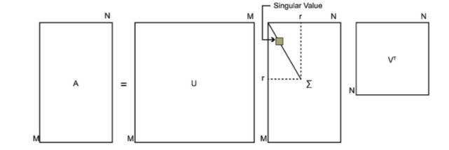
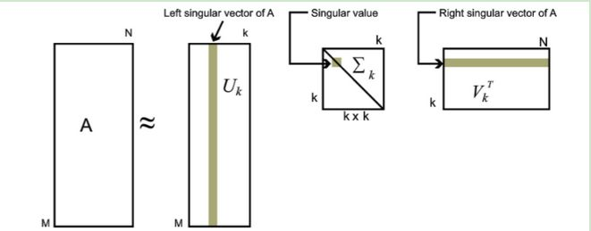

# 第15章 奇异值分解与矩阵近似

### 奇异值分解的定义与性质

- **定义与定理**

  

  

  

  <u>一定存在</u>，但是<u>不唯一</u>

- **紧奇异值分解与截断奇异值分解**

  $rank(A)=r,r\leq min(m,n)$

  - 1、紧奇异值分解
    $$
    A=U_r\Sigma_rV_r^T
    $$
    

  - 2、截断奇异值分解

    

    

### 奇异值分解的计算

### 奇异值分解与矩阵近似

### 附录

1、**可对角化定理：**

<u>若n阶矩阵M有n个不同的特征值，则M必能相似于对角矩阵D</u>
$$
P^{-1}AP=D
$$

