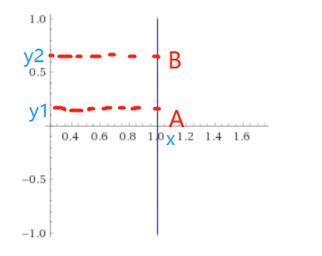

# 第19章 马尔科夫蒙特卡洛方法

### 蒙特卡洛法

- 随机抽样
- 数学期望估计
- 积分计算

### 马尔科夫链

- 基本定义
- 离散状态马尔科夫链
- 连续状态马尔科夫链
- 马尔科夫链的性质

### 马尔科夫链的蒙特卡洛法

- 基本想法

  长时间采样，最终收敛到平稳分布，从m~n时的样本已经平稳，计算期望就从这些样本中计算就好了

  m之前的称为<u>燃烧期</u>，有点像是烧炭，前面燃烧过程还不充分

  值得注意的是，其收敛性判断通常是经验型的

  - 每隔一段时间采样一次，得到多个样本，看均值是否收敛

  而且本采样相邻样本点是相关的

- 基本步骤

  给定一个平稳分布$\pi$，我们要求那个P，满足

  ![[公式]](第19章 马尔科夫蒙特卡洛方法.assets/equation.svg)

  但是很不幸，这个P不太好算

  ![[公式]](%E7%AC%AC19%E7%AB%A0%20%E9%A9%AC%E5%B0%94%E7%A7%91%E5%A4%AB%E8%92%99%E7%89%B9%E5%8D%A1%E6%B4%9B%E6%96%B9%E6%B3%95.assets/equation-1564809348834.svg)

  这个P不好算，我们可以从一个Q进行修正，就像之前采样的q修正出p一样！！

  随意给一个Q，很容易有

  ![[公式]](%E7%AC%AC19%E7%AB%A0%20%E9%A9%AC%E5%B0%94%E7%A7%91%E5%A4%AB%E8%92%99%E7%89%B9%E5%8D%A1%E6%B4%9B%E6%96%B9%E6%B3%95.assets/equation-1564809391280.svg)

  但是我们两边加点东西，强行让其相等，满足平稳条件

  ![[公式]](%E7%AC%AC19%E7%AB%A0%20%E9%A9%AC%E5%B0%94%E7%A7%91%E5%A4%AB%E8%92%99%E7%89%B9%E5%8D%A1%E6%B4%9B%E6%96%B9%E6%B3%95.assets/equation-1564809427411.svg)

  这个$\alpha(i,j)$看起来好神奇，但是其实是构造出来的

  ![[公式]](%E7%AC%AC19%E7%AB%A0%20%E9%A9%AC%E5%B0%94%E7%A7%91%E5%A4%AB%E8%92%99%E7%89%B9%E5%8D%A1%E6%B4%9B%E6%96%B9%E6%B3%95.assets/equation-1564809461000.svg)

  这时有

  ![[公式]](%E7%AC%AC19%E7%AB%A0%20%E9%A9%AC%E5%B0%94%E7%A7%91%E5%A4%AB%E8%92%99%E7%89%B9%E5%8D%A1%E6%B4%9B%E6%96%B9%E6%B3%95.assets/equation-1564809455298.svg)

  这个$\alpha(i,j)$就是在从i->j的时候，在基础的Q上，增加了一个<u>接受概率</u>

  

  

  例子：

  我想用抛硬币产生一个3:7的正反比，正常的抛硬币肯定不行，因为其P是0.5,0.5转移的；那么就需要在设置 $\alpha(*,\text{正面})=0.3,\alpha(*,\text{反面})=0.7$ 就行了

  

  但是有问题：这个接受概率是可能比较小，导致大部分转移都被拒绝了

- 马尔科夫链蒙特卡洛法与统计学习

### Metropolis-Hastings采样

- 基本原理

  还是硬币那个例子，如果你足够睿智，你会想到其实上面没必要*0.3，我固定反面出现的概率还是0.5，但是降低正面出现的概率为3/7=0.42就行了，两边的转移概率就都大了一点

  写成公式就是如下（注意i，j的顺序）

  ![[公式]](第19章 马尔科夫蒙特卡洛方法.assets/equation-1564811048936.svg)

  这样 $\alpha(i,j)，\alpha(j,i)一定有一个<1，另一个=1$

  

  - 马尔科夫链

  - 建议分布

    我上面的例子中，建议分布Q就是对称的，这样就可以消去$Q(i,j)和Q(j,i)$

    ![[公式]](第19章 马尔科夫蒙特卡洛方法.assets/equation-1564811184627.svg)

  - 满条件分布

- Metropolis-Hastings算法

- 单分量Metropolis-Hastings算法

### 吉布斯抽样

- 基本原理

  高维样本点与样本点之间的转移，可以是逐个维度转移

  任意两点都可以构造细致平稳条件

  ![[公式]](第19章 马尔科夫蒙特卡洛方法.assets/equation-1564811681489.svg)

  比如下图，A，B，其x相同，y不同

  

  可以构造
  $$
  \pi(x,y_1)\pi(y_2|x)=\pi(x,y_2)\pi(y_1|x)\\
  \pi(x)\pi(y_1|x)\pi(y_2|x)=\pi(x)\pi(y_2|x)\pi(y_1|x)\\
  $$

- 吉布斯抽样算法

- 抽样计算