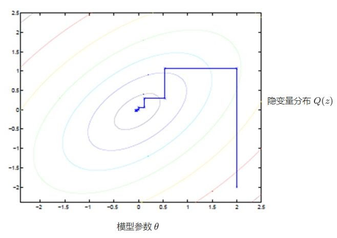

# 第九章 EM算法

#### 1、为什么说EM算法“含有<u>隐变量</u>的概率模型参数的<u>极大似然估计</u>法”？ P175

解答：

全文均以二维数据点聚类为例，使用GMM算法。  

可观测变量Y是数据的位置$\vec{x}= (x_1,x_2)$，<u>隐变量Z</u>则是代表当前某个数据点是由哪一个分布产生的

记第i个高斯分布的参数为$\theta_i=(\mu_k,\sigma^2_k)$，高斯的分布的均值和方差。那么EM算法希望找到一个整体参数$\theta(\pi_1,\pi_2,...,\pi_k;\theta_1,\theta_2...\theta_k)$使得产生当前数据点集的概率最大，也就是似然函数$P(Y|\theta)$最大，<u>极大似然</u>

  

#### 2、请解释EM算法的似然函数？ P179

解答：

>  似然函数：在假定当前的参数$\theta$成立下的条件下，能生成当前数据集的概率

GMM似然函数

在开始前，假定我们已经拿到一个$\theta(\pi_1,\pi_2,...,\pi_k;\theta_1,\theta_2...\theta_k)$    

我们从一个样本点$x_n$开始分析。（由于样本点是独立的，所以最终整体的似然函数就是连乘）  

​			一个样本点$x_n$被第i个高斯模型生成的概率 = $p(x_n|\theta_i)$

​			但是一个样本点并不一定只能由第i个模型产生，可能是第1个高斯分布，也可能是第2个，或者第3个....只是不同的模型生成出该点的概率不同罢了，分别为$p(x_n|\theta_1),p(x_n|\theta_2),p(x_n|\theta_3)...$

​			同时一个点属于不同模型的概率也不一样，分别为$\pi_1,\pi_2,\pi_3...$

所以一个样本点被GMM生成的概率：
$$
p(x_n|\theta)=\sum_{i=1}^{k}\pi_i p(x_n|\theta_i)
$$
遍历整个数据集的N个点，由于独立性假设，最终似然函数的形式为上式的连乘：
$$
p(Y|\theta)=\prod_{n=1}^N\sum_{i=1}^{K}\pi_i p(x_n|\theta_i)
$$

《统计机器学习》P179页公式
$$
\begin{align}
	L(\theta)&=\log(P(Y|\theta)) \quad &\text{#对似然函数取对数方便计算loss}\\
	&=\log\sum_Z P(Y,Z|\theta) &\text{#边缘分布公式，对Z求和消去Z}\\
	&=\log \left( \sum_ZP(Y|Z,\theta)P(Z|\theta) \right)&\text{#P(Y,Z)=P(Y|Z)P(Z)}\\
\end{align}
$$
对应到GMM算法中，P(Z|\$theta$)表示某一个模型被选中的概率，对应$\pi_1,\pi_2,\pi_3...$；$P(Y|Z,\theta)$表示已经选中了模型和参数，生成Y的概率，对应$p(Y|\theta)=\prod_{n=1}^N\sum_{i=1}^{K}\pi_i p(x_n|\theta_i)$  

  

#### 3、如何直观理解EM算法中的E步和M步？ P185

解答：

E：**Expectation**

M：**Maximization** 

这两个步骤来源于统计中的一对矛盾：**分组**与**估计参数**

> 问题引入：
>
> 假设我是王者荣耀的运营官，我手上有用户的浏览时长数据。已知用户只有分为小学生和大学生，根据我司研究在手机游戏上，小学生的浏览时长接近均匀分布，从0~10h几乎等可能，斜率a接近0，截距b接近1；大学生是正态分布，中值μ接近5，方差σ接近1。
>
> 现在有这样一个问题，我想估计两个群体的行为参数，也就是建模斜率a，截距b，中值μ，方差σ。这让才能更好地推出付费道具。
>
> 但是糟糕的是，小学生们纷纷使用了爸妈的身份证进行实名认证，我无法拿到真实的数据标签，眼前一维数轴上的点仅仅反映了他们的使用时长。
>
> 请问我应该怎么完成建模工作？

首先，如果我有数据标签，那我用excel先筛掉小学生的数据，单独用正态分布对大学生建模，用极大似然，就可以很好地估计出μ和σ；再全部筛掉大学生的数据，用线性分布对小学生建模，一样能估计出a和b。

反过来，如果我们没有数据标签，但是我有准确的参数。那我可以用似然函数判断出大学生或小学生模型产生该时长的概率。比如某一个用户时长为0h，那他有比较大的概率是小学生，而比较小的概率是大学生。

但是我两者都没有，而且我还要同时估计这两个，非常棘手！

但是上面这个解题思路给了我们启发，只要有任何一边满足，我们都可以求解另一个，而两者相互制约，可以互为监督。

那么我们先随便分组，然后分组完估计一下模型参数，更新参数后发现一些点更容易出现在其他组，于是换组，重新更新参数，更新参数后再调整组......

初始化一个参数，

E算出当前参数下的分组

M根据当前分组更新参数

新的思路：

这犹如在x-y坐标系中找一个曲线的极值，然而曲线函数不能直接求导，因此什么梯度下降方法就不适用了。但固定一个变量后，另外一个可以通过求导得到，因此可以使用坐标上升法，一次固定一个变量，对另外的求极值，最后逐步逼近极值。对应到EM上，**E步：**固定 θ，优化Q；**M步：**固定 Q，优化 θ；交替将极值推向极大。  

*https://zhuanlan.zhihu.com/p/36331115*
下图是似然函数关于模型参数θ和隐变量Z的等高线图  

#### 4、解释算法的推导细节 P179

解答：

从*“利用Jensen不等式得到其下界”*这句开始：

第一个等号，左式分子分母了一个$P(Z|Y,\theta^{(i)})$，相当于詹森不等式中的λ

第二个等号，使用詹森不等式，λ拉到log外

第三个等号，$\log P(Y|\theta^{(i)})=\sum_ZP(Z|Y,\theta^{(i)}) \log P(Y|\theta^{(i)})$，因为$\sum_ZP(Z|Y,\theta^{(i)})$=1，然后有
$$
\sum_ZP(Z|Y,\theta^{(i)}) \left( \log \frac{P(Y|Z,\theta)P(Z|\theta)}{P(Z|Y,\theta^{(i)})} - \log P(Y|\theta^{(i)}) \right)
$$
$B(\theta,\theta^{(i)})$是$L(\theta)$的下界，有
$$
\theta^{(i+1)}=\mathop {argmax}_{\theta}B(\theta,\theta^{(i)})
$$
在求argmax时，只关心是否最大，不关心绝对大小，因此$\theta^{(i)}$作为与θ无关的常量也被去掉了

#### 5、EM算法的公式解释？ P178

解答：

①E步为什么要求Q？

首先，Q是从P180的式(9.17)得到

其次，Q的形式$\sum_Z\log P(Y,Z|\theta)P(Z|Y,\theta^{(i)})$，可以看做$\sum f*p$，后面概率是对前面对数似然函数的加权，所以是一个期望。

此式表达的意义是，先前的θ估计值$\theta^{(i)}$会影响分组结果Z；而分组结果不同，使用的模型不同，进而算出的似然值也不会相同。

Z是依赖于Y和$\theta^{(i)}$的，所以分组情况分布写作$P(Z|Y,\theta^{(i)})$；每一种分组情况都一种$\log P(Y,Z|\theta)$，所以加权起来得到**似然值关于分组情况的期望**

②M步如何最大化？

参数独立性假设，可以用偏导=0，分别解出最大值

#### 6、如何理解EM的收敛性？ P181

解答：

根据上一问，两次迭代<u>分组变动</u>不大，后者两次迭代<u>模型参数</u>变动不大，都会导致模型收敛。

分组变动大小体现在Q函数上；模型参数变动体现在$||\theta^{(i+1)}-\theta^{(i)}||$

EM是在最大化似然函数，只要保证每一步似然函数都在增大即可

解释公式
$$
\begin{align}
	\log P(Y|\theta)&=\sum_Z P(Z|Y,\theta^{(i)})\log P(Y|\theta) \quad &\text{前面概率和=1} \\
	&=\sum_Z P(Z|Y,\theta^{(i)}) \left(\log P(Y,Z|\theta)-\log P(Z|Y,\theta^{(i)}) \right)\quad &\text{log裂项} \\
	&=\sum_Z P(Z|Y,\theta^{(i)})\log P(Y,Z|\theta)-\sum_Z P(Z|Y,\theta^{(i)})\log P(Z|Y,\theta^{(i)}) \\
	&=Q(\theta,\theta^{(i)})-H(\theta,\theta^{(i)})
\end{align}
$$

#### 7、EM算法在GMM模型中的应用 P184

解答：

随机初始化，分组，更新权重，分组，更新权重，分组，更新权重。。。

- 分组概率，每一个点j被第k个高斯分布产生的概率

$$
\hat{\gamma}_{jk}=\frac{\alpha_k\phi(y_j|\theta_k)}{\sum_{j=1}^K \alpha_k\phi(y_i|\theta_k)}

$$

- 模型参数

  高斯均值μ

$$
\hat{\mu}_{k}=\frac{\sum_{j=1}^N\hat{\gamma}_{jk}y_j}{\sum_{j=1}^N\hat{\gamma}_{jk}}
$$

​		高斯方差
$$
\hat{\sigma}_{k}^2=\frac{\sum_{j=1}^N\hat{\gamma}_{jk}(y_j-\mu_k)^2}{\sum_{j=1}^N\hat{\gamma}_{jk}}
$$
​		高斯模型出现概率
$$
\hat{\mu}_{k}=\frac{\sum_{j=1}^N\hat{\gamma}_{jk}y_j}{\sum_{j=1}^N\hat{\gamma}_{jk}}
$$

#### 复习问题

EM 算法的优化结果与初始值的选取无关？ 

A：有关

似然函数在 EM 算法下是（） 的？

A：单调下降

EM算法是总会收敛，且能收敛到全局最优解。

A：错误。

EM算法可以结合朴素贝叶斯的学习？

A（zy）：朴素贝叶斯指的是数据中各个维度独立。对于特定维度可以分开求解