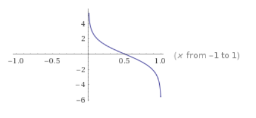
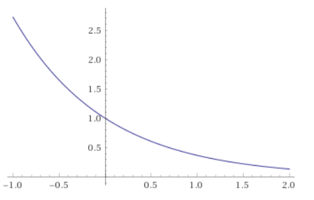

# 第八章 提升方法

#### 1、Adaboost算法过程简介 P157

解答：

误差率考虑了权重

$\alpha_m$作为是第m个分类器G的权重，误差e越大，权重越小；而且误差>50%后，权重为负

$\alpha_m=\frac{1}{2}\log\frac{1-e_m}{e_m}$的图像如下

权重因子：

当$\omega_{m+1,i}=\exp(-\alpha_my_iG_m(x_i))>0$，说明$y_i$与$G_m(x_i)$同号，分对了。越大则越小——某数据点分得已经很对，下次就不用加强

当$\omega_{m+1,i}=\exp(-\alpha_my_iG_m(x_i))<0$，说明$y_i$与$G_m(x_i)$异号，说明分错了。值越大——某数据点分得很对，下次就加强

|      | $\omega_{m+1,i}=\exp(-\alpha_my_iG_m(x_i))$ | $\alpha_m$ |      |
| ---- | ------------------------------------------- | ---------- | ---- |
|      |                                             |            |      |

最终使用判别时使用
$$
\begin{align}
G(x)&=sign(f(x))\\
&=sign\left(\sum_{m=1}^M\alpha_mG_m(x)\right)
\end{align}\
$$
符号函数是“举手表决”，各个分类器加权求和，最终为+，则判为+1，为-，则判为-1

#### 2、Adaboost训练误差分析 P161

为什么对loss函数上界取最小值，能使得训练误差下降最快？

训练误差能以指数级下降？

我认为是因为数据集权值是有指数级差异导致的，误分类的样本权值被相对放大了$e^{2\alpha_m}$倍

P161下方的证明中，指数形式由$Z_m$引入，而$Z_m$本身就是由权重定义时引入的。

#### 3、什么是<u>加法模型</u>？什么是<u>前向分步算法</u>？P162

解答：

前向分布算法，每次只学习一个基函数

#### 4、前向分布算法推导AdaBoost P164

解答：

前提，前向分步算法的损失函数是指数损失函数时，两者等价

$G_m^*(x)$是怎么求得的？

#### 5、什么是提升树？ P166

解答：

提升树就是基函数为决策树的提升算法，分类问题中基函数是二叉分类树，回归问题中基函数是二叉回归树

提升树中基函数是树桩，$x<v$或$x>v$，可以看成是一个根节点直接连着两个叶结点

#### 课后习题

多专家组合方法， 是一种串行结构，其中下一个分类器只在前一个分类 器预测不够准（不够自信）的实例上进行训练或检测。

A：错误

数据科学家可能会同时使用多个算法（模型）进行预测， 并且最后把这些算法的结果集成起来进行最后的预测（集成学习）。模型之间的相关性是？

A：低相关性