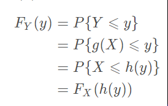
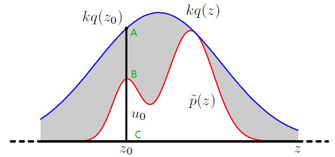

# 采样

### 随机变量采样问题

计算机可以轻松生成0~1的均匀分布随机数，但是如何产生特定概率密度的函数呢？

一个很自然的想法是做函数变换，原来产生1，现在变成f(1)，可能映射后的空间使得一些值更拥挤了，密度就上升了，或者消灭了一些值的可能性（例如y=2*x+1，很显然P(0<y<1)=0）

### 逆变换采样

基本思路就是：两个累积分布函数联系起来

比如我想把0~1均匀分布p(x)=1，变成p(y)=y的分布。

X的CDF为$F_X(x)=x$，Y的CDF为$F_Y(y)=\frac{1}{2}y^2$
$$
\begin{align}
F_Y(y)&=F_X(h(y))\\
\frac{1}{2}y^2&=h(y)\\
y&=\sqrt{2x}
\end{align}
$$

这个结论可以总结为：[逆变换方法](https://zhuanlan.zhihu.com/p/55653004)

![[公式]](补充知识：连续随机变量的函数.assets/equation.svg)

意思就是用U，套上$F_X^{-1}$就可以得到X，神奇！

证明：

- 正面推导

$$
{\begin{aligned}
&\Pr(F_X(X)\leq y)\\
&{}=\Pr(x\leq F_X^{-1}(y))\quad &(\text{左右都使用 }F_X^{-1})\\
&{}=F_X(F_X^{-1}(y)\quad &({\text{因为 }}\Pr(X\leq x)=F_X(x),{\text{ 这是定义}})\\
&{}=y\quad &(f(f^{-1}(y))=y)\\
\end{aligned}}
$$

- 反向推导

$$
{\begin{aligned}&\Pr(F^{-1}(U)\leq x)\\&{}=\Pr(U\leq F(x))\quad &({\text{applying }}F,{\text{ to both sides}})\\&{}=F(x)\quad &({\text{because }}\Pr(U\leq y)=y,{\text{ when U is uniform on}}(0,1))\\\end{aligned}}
$$

这里我们马上意识到两个重要点：

1. CDF必须存在（也就是概率密度可积）
2. 这种变换必须要有反函数，换言之必须是单调的

### 接收拒绝采样

q是一个正常分布，归一化的，称为<u>建议分布</u>

乘上k，不在归一化，用kq来拟合$\tilde{p}$，要求这个k能够满足kq>$\tilde{p}$

将kq作为归一化概率1，A~C当做0~1；B~C是0~p

按照q采样（记得q是分布），而是否采样，则取决于$\frac{1}{kq}\tilde{p}$

**建议分布q与目标分布p越接近，采样效率越高**，否则大概率拒绝从q采样的样本

Q：为什么有p了不直接按其概率采样呢？

A：因为我们拿到的其实不是p，而是$\tilde{p}$，两者关系是$p(z)=\frac{1}{Z_p}\tilde{p}(z)$，归一化因子难算

拿到的$\tilde{p}(x1)=10.12$，这种显然不能采样。

拿到q(x1)=0.8，则以0.8采样出一个x1，然后计算$\frac{1}{kq}\tilde{p}$是否接受这个样本

### 重要性采样

例子：

想要均匀抽取王者荣耀玩家数据，玩家的分布稍难以抽取（比如说是80%男生，20%女生，这是p），但是最好采样的是直接从男女生采样（男生50%，女生50%，这是q）

直观来看，用q采样，肯定出问题，所以应该给男生0.8权重，女生0.2权重。

|      | 人数 | 权重 | 真实人数 |
| ---- | ---- | ---- | -------- |
| 男生 | 50   | 0.8  | 40       |
| 女生 | 50   | 0.2  | 10       |

这样就符合p的分布了

